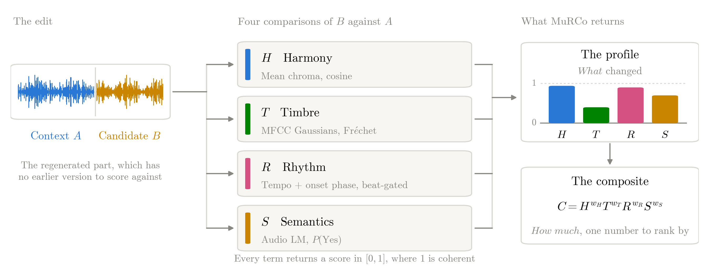
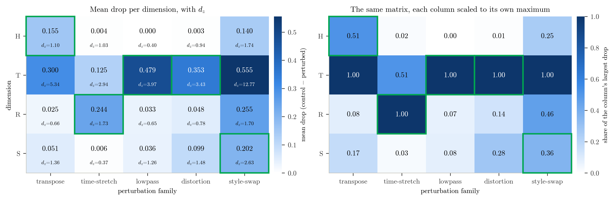

<div align="center">

# MuRCo

### Relational Coherence for Iterative Music Editing

Chi Wang Cheung &nbsp;·&nbsp; Jagmohan Chauhan

Department of Computer Science, University College London

[](LICENSE)
[](LICENSE-DATA)
[](env/dsp_minimal.yml)


</div>

---

When a generative model regenerates part of a recording, the new passage has no earlier
version to compare against. Every edit after the first conditions on audio an earlier edit
produced, so whatever the model got slightly wrong comes back as ground truth and the error
compounds. Almost every audio measure in use is *absolute*: it takes one clip and scores it
on its own, so a well-produced passage lifted from a different piece scores well even though
that is exactly the failure an editing loop produces.

**MuRCo scores a segment against its neighbour instead of on its own.** Given a context
segment `A` and the segment `B` placed beside it, it asks how well `B` belongs after `A`,
and returns four interpretable scores where existing measures return one.

<p align="center">
  
</p>
<p align="center">
  <sub>The four terms compare <code>B</code> against <code>A</code>, and MuRCo reports them two ways.
  The profile says <em>what</em> changed, because each term responds to the manipulation it targets.
  The composite <code>C</code>, their weighted geometric product, says <em>how much</em>, and is the
  single number to rank candidates by. Multiplying rather than averaging keeps the criteria
  conjunctive, so a high score on one axis cannot compensate for a failure on another.</sub>
</p>

<p align="center">
  
</p>
<p align="center">
  <sub>Each edit family leaves a distinct trace across the four dimensions. Left: mean drop from the
  unedited control, with paired effect sizes. Right: the same matrix with each column scaled to its
  own largest entry, so the shade shows the <em>shape</em> of a family's response. Boxed cells mark
  the dimension each family is designed to move.</sub>
</p>

## Contents

- [MuRCo](#murco)
    - [Relational Coherence for Iterative Music Editing](#relational-coherence-for-iterative-music-editing)
  - [Contents](#contents)
  - [Installation](#installation)
  - [Quick start](#quick-start)
  - [The metric](#the-metric)
  - [Results](#results)
  - [Reproducing the paper](#reproducing-the-paper)
  - [Repository layout](#repository-layout)
  - [Pitfalls](#pitfalls)
  - [Data, licences and source recordings](#data-licences-and-source-recordings)
    - [Source recordings](#source-recordings)
    - [Listening-study data](#listening-study-data)
  - [Citation](#citation)

## Installation

Analysis is CPU-only. The semantic term `S` was scored on a GPU once and is served from a
cache in this repository, so nothing here needs a GPU to reproduce.

```bash
git clone https://github.com/HugoCheung1210/MuRCo.git
cd MuRCo
conda env create -f env/dsp_minimal.yml     # creates `t2m-dsp`, Python 3.10
conda activate t2m-dsp
```

Rebuilding the perturbation corpus additionally needs the **`rubberband` command-line
binary**, not only the `pyrubberband` Python wrapper, which is a silent no-op without it.
The conda package is named `rubberband-cli` and is included in the spec above.

Rescoring `S` from scratch needs a CUDA machine and [Music
Flamingo](https://huggingface.co/nvidia/music-flamingo-2601-hf) (~16 GB); see
`env/mf_env.yml`. This is optional.

## Quick start

Score one pair of segments:

```python
import sys; sys.path.insert(0, "scripts")
import _paths                       # puts every scripts/<group>/ on sys.path
import numpy as np, librosa
from coherence_dimensions import build_dimensions

sr = 48_000
a, _ = librosa.load("context_A.wav", sr=sr, mono=True)
b, _ = librosa.load("candidate_B.wav", sr=sr, mono=True)

dims   = build_dimensions("H,T,R")            # add "S" with s_cache=... for the semantic term
scores = {k: d.score(a, b, sr) for k, d in dims.items()}
C      = float(np.prod([v ** (1 / len(scores)) for v in scores.values()]))

print(scores, C)
# {'H': 0.93, 'T': 0.71, 'R': 0.88} 0.83
```

Every dimension implements one contract, `score(a, b, sr) -> float` in `[0, 1]`, where 1.0
means "`B` is perfectly coherent with `A` on this dimension". Score a whole manifest instead
with:

```bash
python scripts/core/score_separability.py \
    --manifest perturbations/pairs_manifest.json \
    --audio-dir perturbations/audio --dimensions H,T,R,S \
    --s-cache results/s_cache/s_scores.json --output-dir results/<run>
```

## The metric

`C(A, B)` is a weighted geometric mean of four terms, each in `[0, 1]`:

$$C(A,B) = H^{w_H} \, T^{w_T} \, R^{w_R} \, S^{w_S}, \qquad \sum\nolimits_d w_d = 1$$

| term | measures | how |
|---|---|---|
| **H** harmonic | which notes the two segments emphasise | cosine between time-averaged chromagrams |
| **T** timbral | tone colour | Fréchet distance between MFCC Gaussians, mapped through `exp(-d/τ)` |
| **R** rhythmic | tempo and beat placement | octave-folded tempo agreement plus onset-envelope correlation, gated by `A`'s beat strength |
| **S** semantic | whether the two sound like one continuous piece | `P(Yes)` read from an audio language model over four questions |

The terms multiply rather than average because the criteria are conjunctive: a high score on
one must not compensate for a failure on another. Weights are uniform unless stated
otherwise, and fitted weights do not beat uniform ones on held-out tracks.

The metric is **asymmetric by construction**. `R` scales by the beat strength of `A` alone
and `S` asks whether `B` continues `A`, so `C(A,B) ≠ C(B,A)`.

**MuRCo ranks competing edits of one passage.** Its scores are not absolute levels to be
compared across pieces, and `S` in particular is calibrated for differences, not levels.

## Results

All numbers below are read from the JSON files named in
[Reproducing the paper](#reproducing-the-paper).

**Identifying which edit was applied.** Multinomial logistic regression, leave-one-track-out
over 90 folds. Chance is 0.20 and the majority class 0.30.

| feature set | dim | accuracy | macro-F1 |
|---|---:|---:|---:|
| **`H,T,R,S` profile** | **4** | **0.860** | **0.842** |
| `H,T,R` (no `S`) | 3 | 0.850 | 0.828 |
| MuQ difference, layer 1 | 1,024 | 0.847 | 0.776 |
| CLAP embedding difference | 768 | 0.832 | 0.776 |
| MERT difference, layer 12 | 1,024 | 0.794 | 0.714 |
| MuQ cosine, layer 6 | 1 | 0.684 | 0.540 |
| SCS stand-in | 1 | 0.668 | 0.456 |
| CLAP cosine | 1 | 0.499 | 0.471 |
| Audiobox Aesthetics | 4 | 0.411 | 0.374 |
| COCOLA | 1 | 0.386 | 0.254 |
| TuneJury | 1 | 0.381 | 0.242 |
| SongEval coherence | 1 | 0.316 | 0.208 |

Four numbers beat a 768-dimensional embedding difference, and every scalar baseline falls
below its own encoder's difference feature: which edit occurred survives inside the
embedding, and squeezing it into one number is what loses it. MuseCPEval is not in this
table because it scores an edit against an aligned copy of the original, which every pair
here happens to supply and an editing loop does not. Given that copy it names the family at
0.970 (`results/diagnostics/diagnosis_musecp.json`).

**Listening study, N = 40.** Part 1, agreement with mean human ratings on 154 pairs
(underlying `r`: 0.788 for `C`, 0.748 for `C_noS`, 0.689 for CLAP, 0.522 for MuseCPEval).
Intervals resample tracks.

| contrast | Δ*r* | 95% CI |
|---|---:|:---|
| `C` − `C_noS` | +0.040 | [+0.017, +0.068] |
| `C` − CLAP | +0.096 | [+0.025, +0.170] |
| `C_noS` − CLAP | +0.056 | [−0.028, +0.137] |
| `C` − MuseCPEval | +0.269 | [+0.177, +0.370] |

Part 2, forced choice between `C`'s pick and a rival's on 80 trials of the same piece with
the middle section regenerated. "Decided" is `C`'s share once ties are dropped, so chance is
0.5. Intervals resample the 36 source pieces.

| rival | *n* | decided | margin (95% CI) |
|---|---:|---:|:---|
| COCOLA | 408 | 0.778 | **+0.43** [+0.31, +0.54] |
| `C_noS` | 332 | 0.760 | +0.40 [+0.28, +0.52] |
| MuseCPEval | 392 | 0.754 | +0.39 [+0.27, +0.50] |
| SCS stand-in | 378 | 0.702 | +0.30 [+0.15, +0.45] |
| CLAP-htsat | 331 | 0.691 | +0.29 [+0.09, +0.46] |
| CLAP-music | 332 | 0.685 | +0.29 [+0.11, +0.46] |

The rows are neither independent nor comparable with one another, since a single trial
answers for every rival whose pick it shows and rivals disagree with `C` at different rates.
Each row tests one rival against chance. The trials were built to settle the five arms other
than MuseCPEval, which was scored afterwards on the 33 trials where it prefers the rival's
candidate, so its row is post hoc. `C` survives Holm's correction whether the family is
counted as five arms or six.

**On the semantic term.** No automatic test in this repository could show what `S` adds. A
CLAP similarity matches or beats `S` alone on identity discrimination, on detecting a
shuffled segment, and on deep-horizon drift, and removing `S` from the edit-family
classifier costs 0.010 accuracy on an interval spanning zero. `S` earns its place on the
listening study and on drift accumulation, where it is the only dimension that compounds
under repeated inpainting. That negative result is reported in full rather than buried.

## Reproducing the paper

Run everything from the repository root. Each row is the file a paper float is read from and
the script that writes it.

| in the paper | file | script |
|---|---|---|
| Table 1, the five edit families | `perturbations/pairs_manifest.json` | `data/make_perturbation_dataset.py` |
| Figure 1, the signature | `results/coherence/matrix.tex` | `core/assemble_matrix.py` |
| Table 2, edit-family diagnosis | `results/diagnostics/diagnosis_nested.json` | `analysis/diagnose_nested_cv.py` |
| Table 2, MuQ cosine row only | `results/diagnostics/diagnosis_nested_muqL6.json` | `analysis/diagnose_nested_cv.py` |
| Table 3, Part 1 correlations | `results/mos/delta_r_live.json` | `analysis/mos_delta_r.py` |
| Table 3, MuseCPEval row | `results/musecp/part1_delta_r.json` | `analysis/mos_delta_r.py --rivals results/musecp/setup1/musecp_metrics.csv` |
| Table 4, Part 2 forced choice | `results/mos/session2/ab_results.json` | `mos/score_ab_session2.py` |
| Table 4, MuseCPEval row | `results/musecp/part2.json` | `analysis/musecp_part2.py` |
| §5.3 Part 2 Holm correction | `results/mos/session2/holm.json` | `analysis/part2_holm.py` |
| §5.1 leave-one-dimension-out | `results/diagnostics/diagnosis_loo.json` | `analysis/diagnose_loo.py` |
| §5.1 MuseCPEval on aligned copies | `results/diagnostics/diagnosis_musecp.json` | `analysis/diagnose_musecp.py` |
| §5.1 per-family F1, §5.3 ties | `results/diagnostics/review_additions.json`, `review_fixes.json` | `analysis/review_additions.py`, `analysis/review_fixes.py` |
| §5.2 drift accumulation | `results/drift/drift_htrc_*.json` | `drift/drift_htrc.py` |
| §5.2 identity AUC | `results/coherence/C*.json` | `core/compute_S_value.py` |
| §3 τ invariance | `results/coherence/tau_sensitivity.json` | `analysis/tau_sensitivity.py` |

Paths in the last column are relative to `scripts/`. `scripts/README.md` and
`results/README.md` index every script and output tree, including the work that goes beyond
what the four-page paper reports: GRPO training against `C`, best-of-N re-ranking,
backbone comparisons and the prompt and gap ablations on `S`.

**From nothing.** Only two steps need anything beyond the CPU environment, and both write a
cache everything downstream reads:

1. `scripts/data/make_perturbation_dataset.py` rebuilds the audio from the Free Music
   Archive. Needs the `rubberband` binary.
2. `scripts/s_backbone/score_s_mf.py` scores the semantic term on a GPU. Its output,
   `results/s_cache/s_scores.json`, **is shipped**, so this step can be skipped entirely.

Embedding caches under `results/baselines/*.npz` are not shipped, being derived payload
rather than results. `clap_probe.py extract` and `ssl_probe.py extract` regenerate them;
scripts that need them fail with a clear `FileNotFoundError` until they exist.

## Repository layout

```
scripts/
  core/          the metric: dimension contract, separability, C, ablations
  data/          FMA source selection and the perturbation corpus builder
  s_backbone/    Music Flamingo / Qwen-Omni probes and the S cache (GPU)
  drift/         the iterative-edit drift protocol
  analysis/      baselines, diagnosis, sensitivity sweeps, figures
  mos/           listening-study stimuli, Qualtrics build and ingest, scoring
  rerank/, rl/   best-of-N re-ranking and GRPO training against C
  generators/    ACE-Step, Stable Audio and VampNet wrappers
results/
  coherence/     pair scores, C and its leave-one-out ablations, the matrix
  s_cache/       s_scores*.json, the semantic-term cache
  diagnostics/   edit-family classification, probes, sensitivity
  mos/           listening-study ratings and analysis
  rerank_ace/    best-of-N re-ranking on ACE-Step inpainting, 40 seeds x 8 candidates
  musecp/        MuseCPEval scored on every pair and candidate, with its Part 1 and Part 2 readouts
  drift/, baselines/, omni/, temporal/
figures/         every generated figure, as PDF and PNG
env/             verified conda specs for both environments
perturbations/   pairs_manifest.json (the corpus recipe; no audio)
sources_selection/  selected_manifest.json (the attribution record)
```

## Pitfalls

**There are two nested-CV implementations and they disagree by about 0.005.**
`diagnose_nested_cv.loto` is the published one and is what Table 2 reports.
`review_fixes.loto_predict` uses a wider `C` grid and a larger inner iteration budget.
Compare a new feature set against the former, or the baseline will not reproduce.
`diagnose_loo.py` is calibrated to the published one and reproduces 0.860 / 0.842 as its
own check, so its ablations are directly comparable with Table 2.

**`compute_C.py` clobbers `results/coherence/C.json` if you omit `--out`.** Always name an
output when fitting weights.

**`results/mos/mos_live.csv` is the analysed dataset**, one mean opinion score per pair, and it
is what every reported Part 1 number is computed from. The per-session files under
`results/mos/responses/` carry no timestamps. The raw survey export it is built from,
`results/mos/final/N40.csv`, is included for completeness and does carry session timestamps.
The `final/` name is load-bearing: collection is closed and that file is the
authoritative set of 40, so `refresh_live.py` reads it in preference to anything else.

**MusicWeaver's SCS is not publicly released.** What is scored here is a documented stand-in
built from self-similarity structure, not a reimplementation, and it is labelled as such
throughout.

**`results/separability.json` is the main run**, all 1,890 pairs across `H,T,R,S`, and it is
what Figure 1 reads. Every other experiment writes its own into its own run tree
(`results/temporal/`, `results/omni/`, `results/rl/eval_*/`, and so on), so
`assemble_matrix.py --in` always names which one you mean.

## Data, licences and source recordings

This repository holds two kinds of material under two licences, and draws on a third body of
work that is not redistributed here.

| | covers | licence |
|---|---|---|
| Code | `scripts/` | MIT, see [LICENSE](LICENSE) |
| Data and figures | `results/`, `figures/`, the manifests | CC BY 4.0, see [LICENSE-DATA](LICENSE-DATA) |
| Source recordings | not redistributed | the artists' own Creative Commons terms, below |

[LICENSE](LICENSE) is the plain MIT text so that it is detected automatically, and should be
read as covering the code alone. The scope of each licence is this table, not that file.

### Source recordings

The perturbation battery is built from 90 recordings from the
[Free Music Archive](https://freemusicarchive.org). **This repository contains no audio.**
What it contains is the recipe: `sources_selection/selected_manifest.json` records every
source track with its identifier, title, artist and licence, and
`scripts/data/make_perturbation_dataset.py` rebuilds all 1,890 scored pairs from those
sources. Running it downloads the audio from the Free Music Archive under the Archive's own
terms, not under this repository's.

That manifest is the attribution record. It ships precisely so the Attribution condition on
the source licences can be met, and it should not be stripped from a redistribution.

| condition | tracks of 90 | what it binds |
|---|---:|---|
| NonCommercial | 75 | commercial use of a rebuilt battery |
| ShareAlike | 71 | redistribution of derived audio |
| NoDerivatives | 0 | nothing, which is what permits the battery to exist |
| Public Domain | 1 | nothing |

Two consequences follow, and neither can be waived by the licences above, because they are
not this project's rights to grant. **Seventy-five of the ninety sources are NonCommercial**,
and the MIT licence on the code does not extend to them; if you rebuild the battery and use
the result commercially you are bound by the source licences. **Seventy-one carry
ShareAlike**; this release triggers it for nobody, since no audio is distributed, but anyone
who rebuilds the battery and redistributes the derived audio inherits the condition.

The one welcome number is the zero. Every source permits derivative works, which is what
makes a corpus built entirely from controlled perturbations lawful in the first place. That
was checked against all 90 sources rather than assumed, after the selection filter was found
to match only the spelled-out "NoDerivatives" and to miss the abbreviated "NoDerivs" form.

### Listening-study data

`results/mos/` contains the anonymous listening-study ratings. No personal data was
collected. The study was approved by the UCL Computer Science Low Risk Ethics Committee
(Project ID 4972), and the approved application provides for these ratings to be shared
alongside a publication. The generated audio stimuli are **not** included and may not be
redistributed. See [LICENSE-DATA](LICENSE-DATA) for the detail.

## Citation

The paper is under review. This entry will be updated when it appears.

```bibtex
@inproceedings{cheung2027murco,
  title     = {{MuRCo}: Relational Coherence for Iterative Music Editing},
  author    = {Cheung, Chi Wang and Chauhan, Jagmohan},
  booktitle = {Under review, IEEE International Conference on
               Acoustics, Speech and Signal Processing (ICASSP)},
  year      = {2027}
}
```

Please also credit the source recordings through
`sources_selection/selected_manifest.json` if you rebuild the corpus.
</content>
</invoke>
